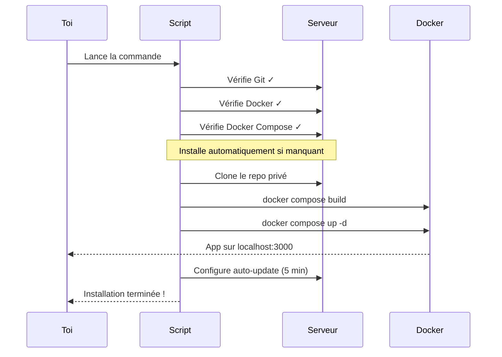

# Installation rapide (one-liner)

**Une seule commande** pour tout installer. Le script s'occupe de tout :
Git, Docker, clone, build, déploiement et auto-update.

---

## La commande magique

!!! example "Copie et colle cette commande"

    === "Avec export (recommandé)"

        ```bash
        export GH_TOKEN=ghp_ton_token_ici
        curl -fsSL "https://${GH_TOKEN}@raw.githubusercontent.com/Jefedi/Nathan-dash/main/install.sh" | bash
        ```

    === "En une seule ligne"

        ```bash
        curl -fsSL "https://ghp_ton_token_ici@raw.githubusercontent.com/Jefedi/Nathan-dash/main/install.sh" | GH_TOKEN=ghp_ton_token_ici bash
        ```

    Remplace `ghp_ton_token_ici` par ton [token GitHub](prerequis.md#token-github).

---

## Ce que fait le script

Voici exactement ce qui se passe quand tu lances la commande :



### Etape par étape

| # | Action | Détail |
|---|---|---|
| 1 | **Prérequis** | Installe Git, Docker, Docker Compose si absents |
| 2 | **Clone** | Clone le repo avec ton token GitHub |
| 3 | **Build** | Construit l'image Docker (Node 22 → Nginx Alpine) |
| 4 | **Lancement** | Démarre le container sur le port 3000 |
| 5 | **Auto-update** | Crée un timer systemd (ou cron) toutes les 5 min |
| 6 | **Vérification** | Teste que l'app répond sur `localhost:3000` |

---

## Après l'installation

!!! success "C'est en ligne !"

    Ouvre ton navigateur et va sur :

    **:material-web: [http://localhost:3000](http://localhost:3000)**

    Si tu es sur un VPS, remplace `localhost` par l'IP de ton serveur.

### Commandes utiles

```bash
# Voir les logs de l'app en direct
cd ~/Nathan-dash && docker compose logs -f

# Redéployer manuellement
cd ~/Nathan-dash && ./deploy.sh

# Arrêter l'app
cd ~/Nathan-dash && docker compose down

# Voir les logs de déploiement
cat ~/Nathan-dash/deploy.log

# Vérifier l'auto-update
sudo systemctl status nathan-dash-updater.timer
```

---

## Réinstallation

Pour tout recommencer à zéro :

```bash
cd ~/Nathan-dash && docker compose down
sudo systemctl disable nathan-dash-updater.timer 2>/dev/null
rm -rf ~/Nathan-dash

# Puis relance le one-liner
```

---

## Dépannage

??? question "Le script échoue avec 'Token GitHub requis'"

    Tu n'as pas défini la variable `GH_TOKEN`. Assure-toi de :

    ```bash
    export GH_TOKEN=ghp_ton_vrai_token
    ```

    avant de lancer la commande.

??? question "Docker permission denied"

    Après l'installation de Docker, il faut se reconnecter :

    ```bash
    # Ajouter au groupe docker
    sudo usermod -aG docker $USER

    # Se reconnecter
    exit
    # puis reconnecte-toi
    ```

??? question "Le port 3000 est déjà utilisé"

    Modifie le port dans `docker-compose.yml` :

    ```yaml
    ports:
      - "8080:80"  # Change 3000 par le port souhaité
    ```

    Puis relance : `docker compose up -d`

??? question "L'auto-update ne fonctionne pas"

    Vérifie le timer :

    ```bash
    sudo systemctl status nathan-dash-updater.timer
    sudo journalctl -u nathan-dash-updater.service --since "1 hour ago"
    ```
